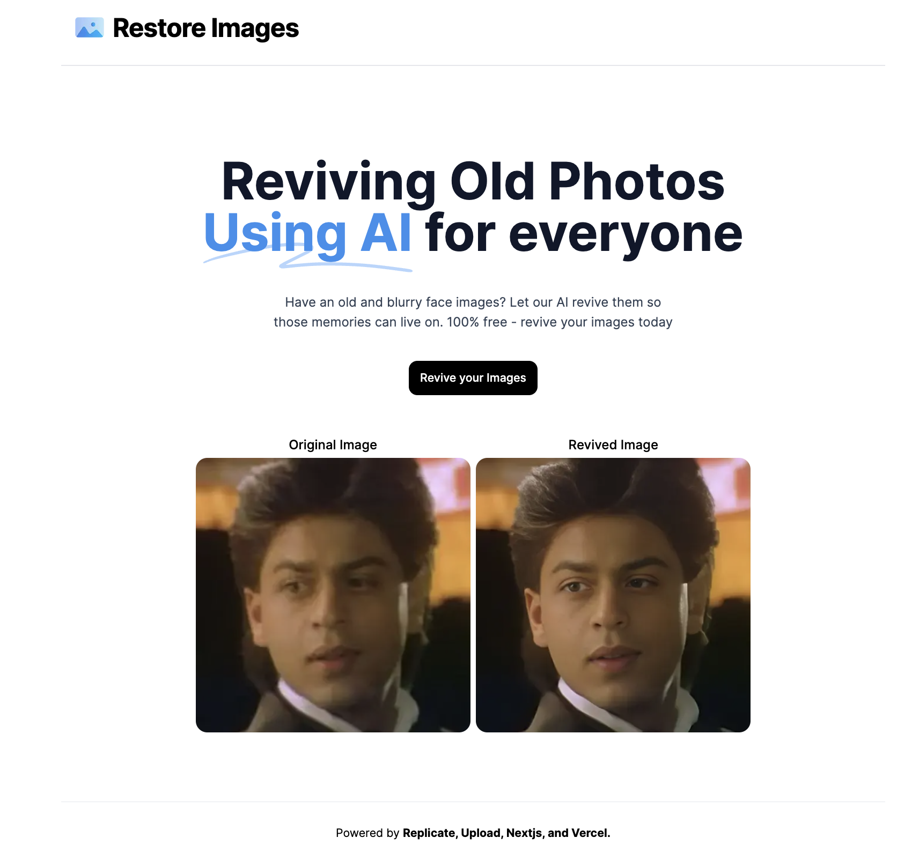

# Restore Images

Welcome to the AI Restore Images - a Next.js application designed to transform your blurry images into clear, high-quality pictures! This app leverages the powerful GFPGAN model from Replicate.io to enhance image quality, ensuring your memories are always crystal clear.



## Features

- **Image Enhancement**: Utilizing the GFPGAN model, this application can turn blurry and low-resolution images into sharper, clearer versions.
- **User Authentication**: Integrated with Clerk for secure and easy user authentication.
- **Easy Upload**: Thanks to React Uploader Zone, users can effortlessly drag and drop images into a beautifully designed dropzone.

## Getting Started

To get started with the Blurry Image Fixer, follow these steps:

### Prerequisites

- Node.js
- npm or yarn

### Installation

1. Clone the repository:
   ```bash
   git clone https://github.com/JaspalSingh1998/ai-restore-photos 

2. npm install

    or

    yarn install

3. npm run dev

    or

    yarn dev

## Usage
1. Sign up or log in using the Clerk authentication service.
2. Drag and drop your blurry image into the React Uploader Zone.
3. Wait for the magic to happen! The GFPGAN model will process your image and enhance its quality.
4. Download or share your enhanced image.

P.S: Use .env.example as a reference to update your own API keys.
